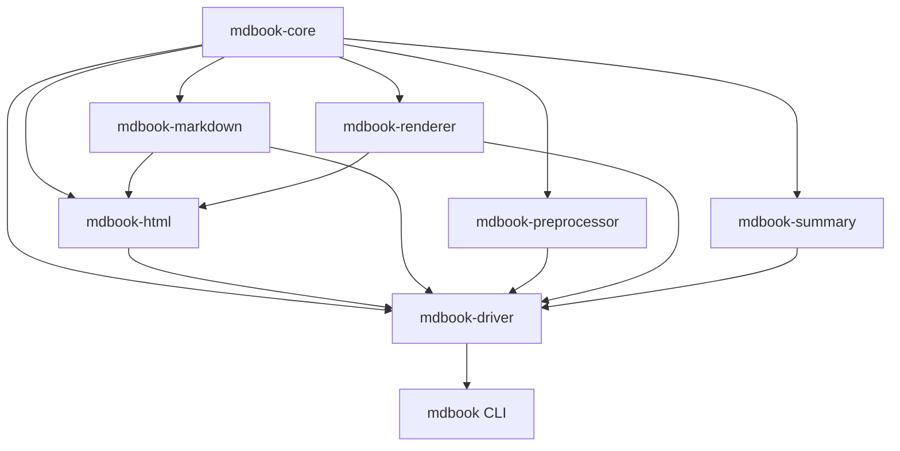

# 整体架构

mdBook 采用“CLI 适配层 + driver 编排层 + 可插拔处理/输出层 + core 数据模型”的分层设计。

```text
用户命令
   │
   ▼
src/main.rs + src/cmd/*       CLI 参数、日志、子命令
   │
   ▼
mdbook-driver::MDBook          加载、预处理排序、renderer 编排
   │             │
   │             ├── mdbook-summary    解析 SUMMARY.md
   │             ├── mdbook-preprocessor 预处理器协议
   │             └── mdbook-renderer  渲染器协议
   │
   ├── mdbook-html               默认 HTML 输出
   ├── mdbook-markdown            Markdown 调试输出
   └── 外部命令 renderer/preprocessor

mdbook-core::Book + Config       跨 crate 的核心数据总线
```

## 两个核心数据对象

- `Book`：由 `BookItem` 树组成，章节保存标题、Markdown 内容、编号、源路径和渲染路径。
- `Config`：从 `book.toml` 加载；`book`、`build`、`rust` 是强类型配置，`output` 和 `preprocessor` 保留 TOML 动态值以支持插件。

## Crate 依赖方向



`mdbook-driver` 是唯一同时依赖所有产品 crate 的编排中心；`mdbook-compare` 和 `xtask` 属于不发布的开发辅助工具。
