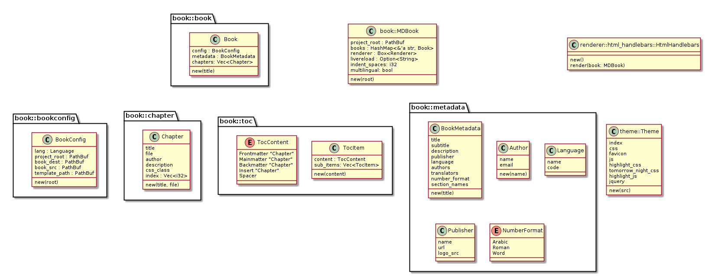

# Doc

Diagrams are with [yEd](http://www.yworks.com/products/yed)
and [plantuml](http://plantuml.com).

## Data

`MDBook::new(root)` parses CLI args and `book.toml` to create:

- app config settings
- `Book` for each language

Each `Book` is given their config setting with their source- and destination
paths.

The renderer can then render each book.

To render the TOC, renderer gets a Vec<TocItem> from summary parser.

The renderer walks through the Vec. It can match content kinds in an enum and
this way knows whether to render:

- front- back- or mainmatter
- spacer elements (vertical space in TOC but no chapter output)
- insert chapters (no TOC link, but the chapter is part of the reading sequence)

### Renderer

Takes a book, which knows:

- metadata
- toc with chapters
- config for paths
- template assets (`template_path`)

For generating pages:

Book metadata, `BookMetadata` (title, author, publisher, etc.). Just recognize
those properties which can be easily anticipated.

If Renderer needs more specific data, it can be supplied in `book.toml`. It's
the Renderer's job to open that and parse it out.

Chapters are represented in a `Vec<TocItem>`, each item has the chapter content
as payload.

If the user wants to store attributes that are not anticipated with structs,
they can go in a hashmap with string keys, let them be accessible from the
templates with helpers.

For generating output:

- template assets, `template-path`, renderer does whatever it wants with it
- config (root, dest, etc. folders)

Renderer is seleceted by CLI or default (html). Each book is passed to this
renderer.

### Config

Takes data from:

- CLI args
- book.toml

## Structs

### Reorganized

### Currently

## Notes

Take config paths for as many things as possible. Let the user organize their
project folder differently, or allow `mdbook` to function in existing projects
with already established folders.

Add config path for `SUMMARY.md`. Default is good to be in `src/`, it allows
chapter links to work when reading the file on Github.

The init command should copy the assets folder by default, it is better to make
this choice for new users.

The specific assets (CSS, templates, etc.) are closely coupled with the book
content when the user is writing it. If the templates change when mdbook
develops, this changes the output in a way the user doesn't expect, maybe even
breaking their book.

