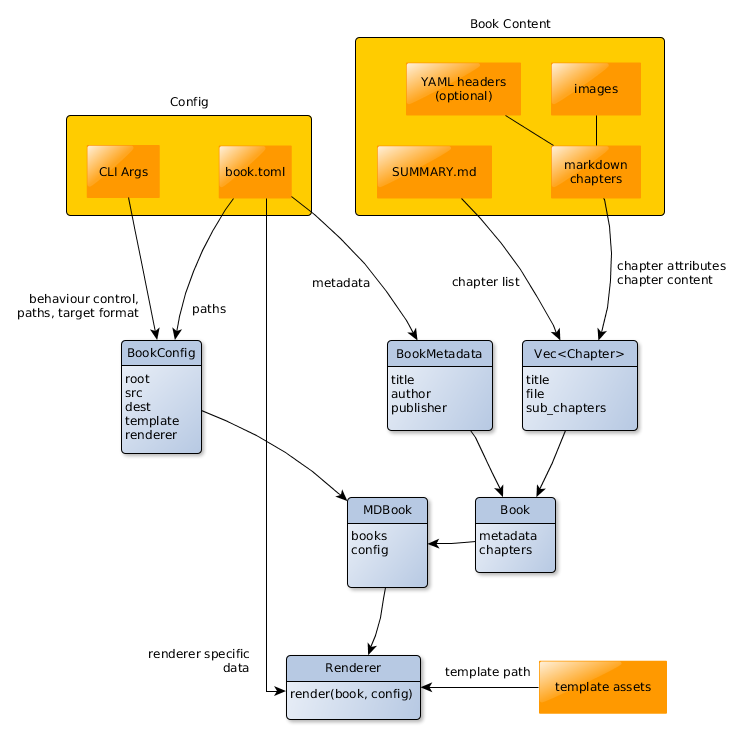
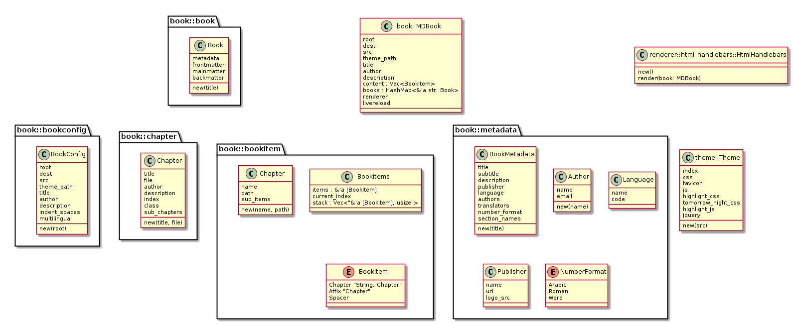

# Doc

Diagrams are with [yEd](http://www.yworks.com/products/yed) and [plantuml](http://plantuml.com).

## Data

### Renderer

Takes data from:

- a book's metadata and chapters (`Book`)
- paths and behaviour config (`BookConfig`)
- template assets (`template_path`)

For generating pages:

Book metadata, `BookMetadata` (title, author, publisher, etc.). Just recognize
those properties which can be easily anticipated.

If Renderer needs more specific data, it can be supplied in `book.toml`. It's
the Renderer's job to open that and parse it out.

Chapters, `Vec<Chapter>`.

If the user wants to store attributes that are not anticipated with structs,
they can go in a hashmap with string keys, let them be accessible from the
templates with helpers.

For generating output:

- template assets, `template-path`, renderer does whatever it wants with it
- config (root, dest, etc. folders)

Renderer is seleceted by CLI or default (html). Each book is passed to this
renderer.

### Config

Takes data from:

- CLI args
- book.json

## Structs

### Currently

Already almost good for implementing the above.

Storing data attributes can be reorganized.

Modules could be refactored to express intention more clearly.

## Notes

There could be less modules. Merge modules which express one intention.

The two Chapter structs could be refactored out.

Take config paths for as many things as possible. Let the user organize their
project folder differently, or allow `mdbook` to function in existing projects
with already established folders.

Add config path for `SUMMARY.md`. Default is good to be in `src/`, it allows
chapter links to work when reading the file on Github.

The init command should copy the assets folder by default, it is better to make
this choice for new users.

The specific assets (CSS, templates, etc.) are closely coupled with the book
content when the user is writing it. If the templates change when mdbook
develops, this changes the output in a way the user doesn't expect, maybe even
breaking their book.

